# Lab 6 - Feature Matching and Classification
*_Peter Cheung, version 1.2, 5 March 2026_*

This laboratory session is designed to support the contents of Lectures 10 and 11 of the module.  

## Task 1: Image resizing

The following image is the famous painting by van Gogh called 'Cafe Terrace at Night', which can be found in the file *_'cafe_van_gogh.jpg'_* in the _'assets'_ folder.  

<p align="center">  </p>

>Write a Matlab program to read this file and build the image pyramid by resize the image by a factor of 1/2, 1/4, 1/8, 1/16 and 1/32 by drop every other rows and columns.  Then display all six images as a montage of size [2 3]. 

> **Notes**:
> Removing the pixels resulted in the image getting blockier and blockier as
> taking pixels away is essential removing image data which loses a lot of
> the geometrical data on object and patterns present in the image
> <p align="center"> 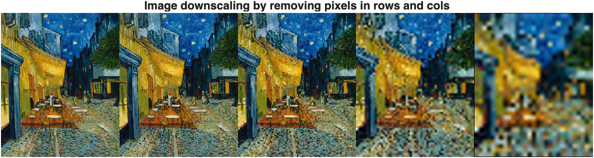 </p>

To drop every other rows and columns in an image, you can use this Matlab syntax: (start: increment: end) to slice the matrix.  Try this Matlab command:

```
1:2:10
1:3:10
```
The first command returns the values: 1, 3, 5, 7 and 9.
The second command returns the values: 1, 4, 7, 10.

> I first, downscaled the image by 1/2, 1/4, 1/8, 1/16, 1/32
> Using the following code:
> ```
> g1 = img(1:2:end, 1:2:end, :);
> g2 = img(1:4:end, 1:4:end, :);
> g3 = img(1:8:end, 1:8:end, :);
> g4 = img(1:16:end, 1:16:end, :);
> g5 = img(1:32:end, 1:32:end, :);
> ```

Matlab provides a proper image resizign function **_imresize(I, scale)_** where I is the input image and scale is the factor to resize.  So 0.5 means the image is reduced by a factor of 2. This function first filter the image by a lowpass filter (Gaussian) that removes the high frequency components before subsampling by skipping pixels.  This prevents aliasing and the introdduction of artifacts.

>Repeat the above exercise by adding code to properly resize the image with the **_imresize_** function.

> **Notes**:
> Using the imresize function yielded much better results as it first blurs the image
> with a low-pass filter, making the image pixel changes smoother and the
> interpolates the pixel values at the new downscaled grid positions, resulting
> in a much smoother, just seemingly more blurry version of the original image.
> <p align="center"> 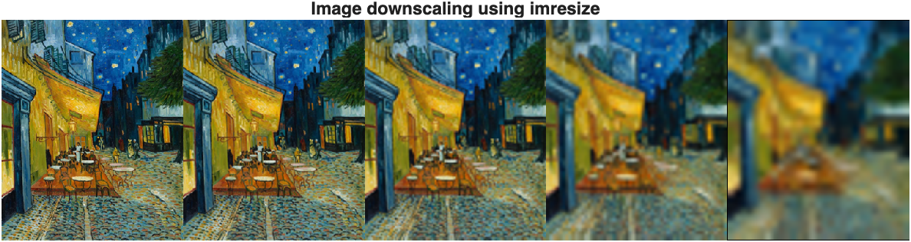 </p>


Compare the results from the two approach to subsampling.

> **Notes**:
> The comparison of the two methods shows clear difference in image quality.
> The pixel removal method yields a blocky and pixellated downscaled image, 
> where as the resize method yields a more smooth but blurrier version of the original
> retaining the geometrical properties of objects and texture patterns.
> <p align="center"> 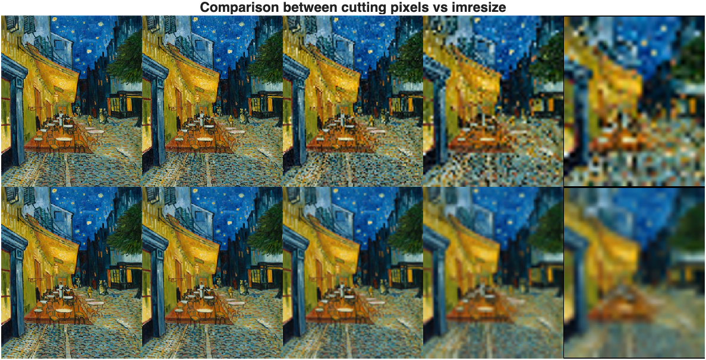 </p>

## Task 2: Pattern Matching with Normalized Cross Correlation

In this task, we will examine how to use Matlab's normalized cross correlation (NCC) function **_normxcorr2( )_** to match a template in file **_'assets/template1.tif'_** to that of the image **_'salvador_grayscale.tif'_**.

The following code will compute the NCC function and plot it as a 3D plot:

```
clear all; close all;
f = imread('assets/salvador_grayscale.tif');
w = imread('assets/template2.tif');
c = normxcorr2(w, f);
figure(1)
surf(c)
shading interp
```

>Try this code and explore the NCC plot between the template and the image.  You should be able manually locate the position of the template from the plot. This will be the location where the normalized cross correlation value = 1.0, i.e. an exact match.

> **Notes**:
> The 3D surface plot shows a clear sharp spike reaching 1.0 at the location
> where the template exactly matches a region in the image. The rest of the
> surface stays relatively low, meaning there is only one strong match.
> <p align="center"> 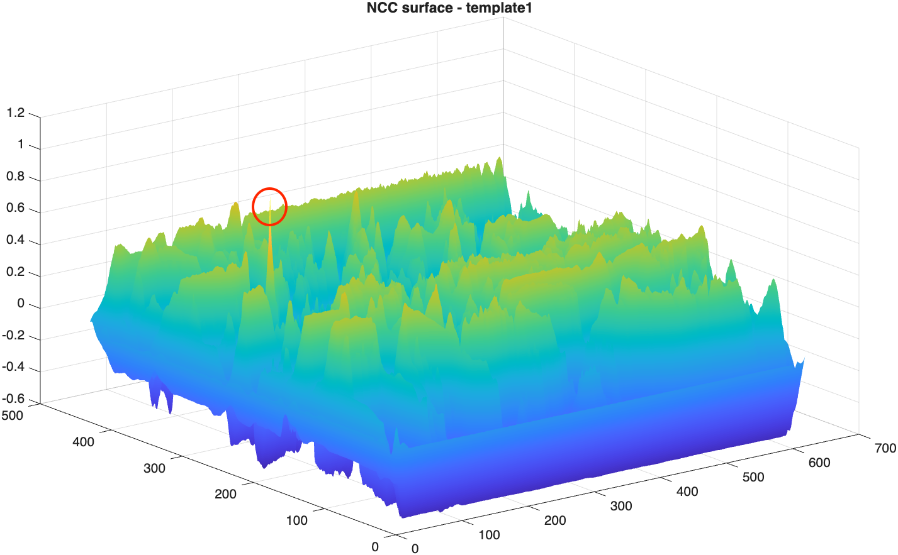 </p>
> <p align="center"> 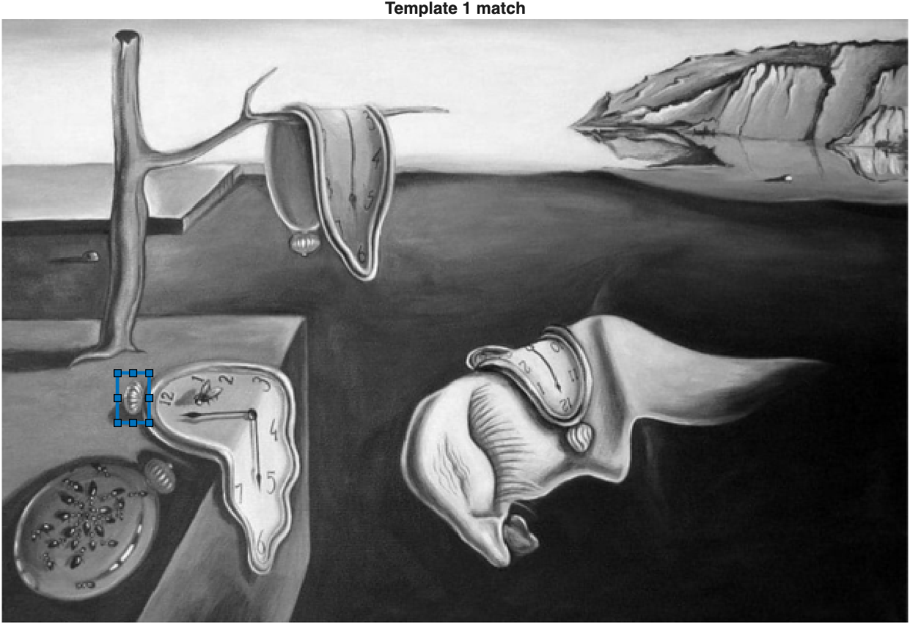 </p>

Now we want to detect the peak location automatically. This is achieve with:

```
[ypeak, xpeak] = find(c==max(c(:)));
yoffSet = ypeak-size(w,1);
xoffSet = xpeak-size(w,2);
figure(2)
imshow(f)
drawrectangle(gca,'Position', ...
    [xoffSet,yoffSet,size(w,2),size(w,1)], 'FaceAlpha',0);
```

>Find out for yourself what the Matlab function **_find( )_** does.  Comment on the results.
>
>Test this procedure again with the second template image **_'template2.tif'_**.

> **Notes**:
> The **_find()_** function returns the row and column indices of all elements
> in a matrix that satisfy a given condition. Here, `find(c == max(c(:)))`
> locates the row and column position of the maximum value in the NCC surface,
> giving us the peak correlation coordinates.
>
> The offset subtraction is necessary because `normxcorr2` outputs a correlation
> map larger than the original image (size of image + size of template - 1 in
> each dimension), so the peak coordinates need to be shifted back by the
> template dimensions to get the correct top-left corner in the original image.

> **Notes**:
> The NCC surface for template 2 does not show a sharp spike reaching 1.0.
> Instead the peak is lower and broader, indicating that there is no exact
> match present in the image.
> <p align="center"> 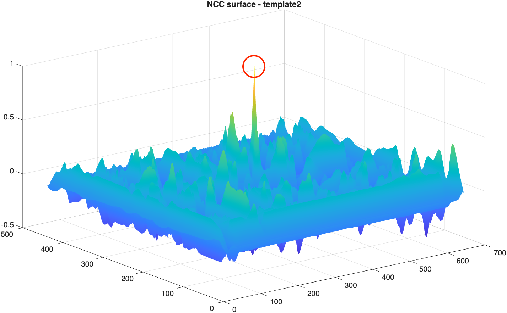 </p>
> <p align="center"> 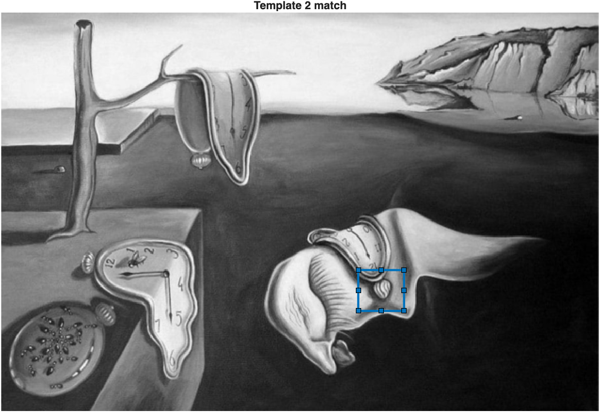 </p>

It is clear that NCC can only match a template to an image if the match is exact or nearly exact.

> **Notes**:
> This demonstrates that NCC is only reliable when the match is exact or
> very close to exact. It is sensitive to changes in scale, rotation, lighting
> and content differences between the template and the image region. For more
> robust matching under such transformations, feature-based methods would be needed.

## Task 3: SIFT Feature Detection

Let us now try to apply the SIFT detector provided by Matlab through the function **_detectSIFTFeastures( )_** on the Dali painting that we used in task 1.

```
clear all; close all;
I = imread('assets/salvador.jpg');
f = im2gray(I);
points = detectSIFTFeatures(f);
figure(1); imshow(I);
hold on;
plot(points.selectStrongest(100));
```
>Comment on the results.
>Explore and explain the contents of the data structure *_points_*. 

> **Notes**:
> The 100 strongest SIFT keypoints are concentrated around areas of high
> contrast and distinctive local structure in the painting, such as edges
> of figures, objects and their features and terrain details. Areas of smooth
> gradient like the sky have very few or no keypoints.
> <p align="center"> 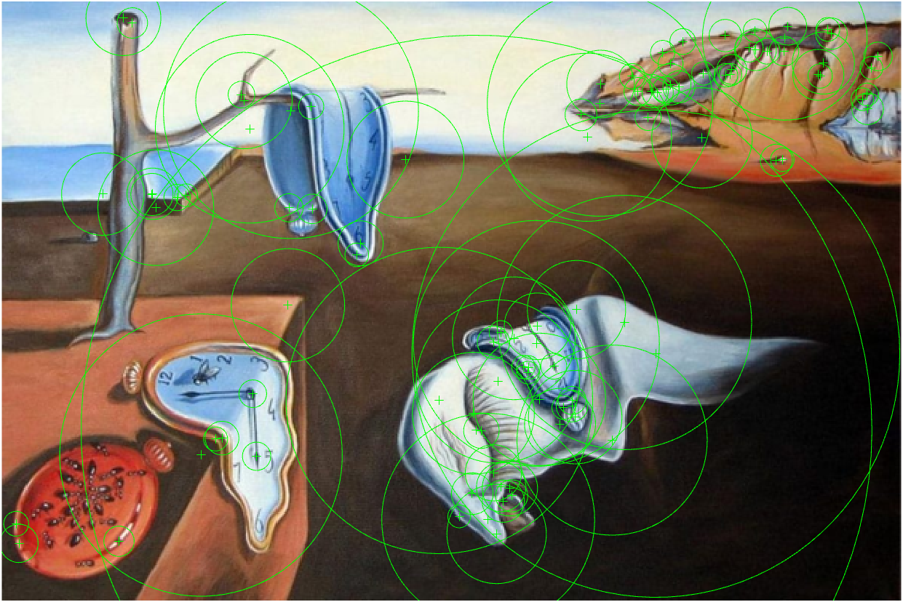 </p>
>
> The `points` variable is a `SIFTPoints` object containing the following properties:
> - **Location** - (x, y) coordinates of each keypoint in the image
> - **Scale** - the scale at which the keypoint was detected, reflecting the size of the local region
> - **Metric** - the strength/response of the keypoint, used for ranking with `selectStrongest()`
> - **SignOfLaplacian** - sign of the Laplacian at the detected scale, useful for distinguishing bright-on-dark vs dark-on-bright blobs
> - **Orientation** - the dominant gradient orientation at the keypoint, which gives SIFT its rotation invariance
> - **Count** - the total number of keypoints detected

You may want to consult this [Matlab page](https://uk.mathworks.com/help/vision/ref/siftpoints.html) about SIFT Interesting Points.

>Find the SIFT points for the image **_'cafe_van_gogh.jpg'_**.
>
> Explore  other methods of feature detection provided by Matlab provided in their toolboxes.

> **Notes**:
> The SIFT keypoints on the Van Gogh painting cluster heavily around the
> textured brushstroke regions and high-contrast boundaries such as the
> edges of the buildings, chairs and tables, people and stars in the sky.
> <p align="center"> 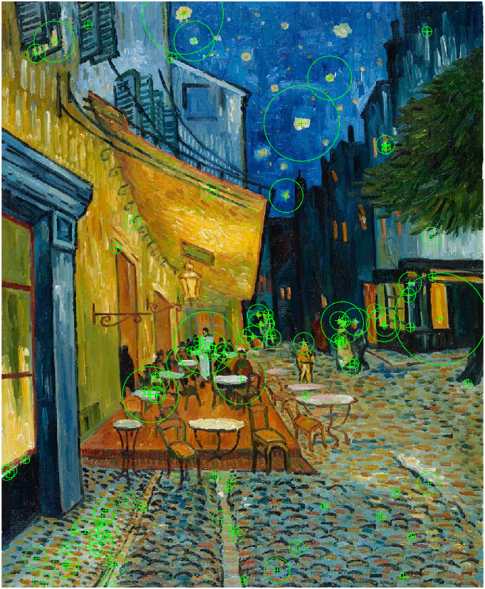 </p>
>
> Three other detectors were tested on the Salvador image:
> - **SURF** - similar to SIFT but faster, uses box filter approximations of Gaussians. Produces keypoints in similar locations to SIFT, but with weaker (smaller circles) identification.
> - **Harris** - detects corners by analysing intensity gradients in local windows. Keypoints cluster tightly on sharp corners and edge intersections rather than blob-like regions.
> - **ORB** - a fast binary descriptor detector which produces keypoints of varying scales similar to SURF, but they appear more clustered around specific high-contrast regions like the melting clocks and figures rather than spread across the whole image
> <p align="center"> 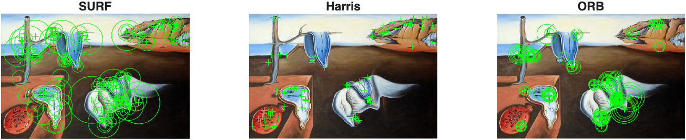 </p>

## Task 4: SIFT matching

We will now use SIFT features from two different scales of the same van Gogh painting to see how well SIFT manage to match the features that are of different scales (or sizes).

Run the following Matlab script:

```
clear all; close all;
I1 = imread('assets/cafe_van_gogh.jpg');
I2 = imresize(I1, 0.5);
f1 = im2gray(I1);
f2 = im2gray(I2);
points1 = detectSIFTFeatures(f1);
points2 = detectSIFTFeatures(f2);
Nbest = 100;
bestFeatures1 = points1.selectStrongest(Nbest);
bestFeatures2 = points2.selectStrongest(Nbest);
figure(1); imshow(I1);
hold on;
plot(bestFeatures1);
hold off;
figure(2); imshow(I2);
hold on;
plot(bestFeatures2);
hold off;
```

The code above finds the _Nbest_ features using SIFT in each iage and overlay the features as cicles onto the image.

>How successful do you think SIFT has managed to detect features for these two images (one is a quarter of the size of the other)?  What conclusions can you make?

> **Notes**:
> SIFT successfully detects features very similarly in both the full size and quarter size
> images, with many of the same keypoints appearing in both. The keypoints
> cluster around the same regions (the stars in the sky, the chairs and
> tables, the cobblestones, and the building edges, people) despite the significant
> difference in resolution. This demonstrates SIFT's scale invariance: because
> it searches for features across multiple scales using a Gaussian pyramid
> internally, the same distinctive structures are detected regardless of image
> size. The circle sizes in the quarter image are proportionally smaller but
> correspond to the same real features in the full size image.
> <p align="center"> 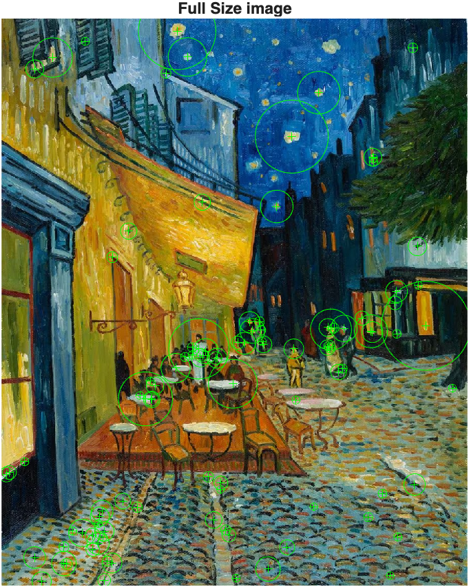 </p>
> <p align="center"> 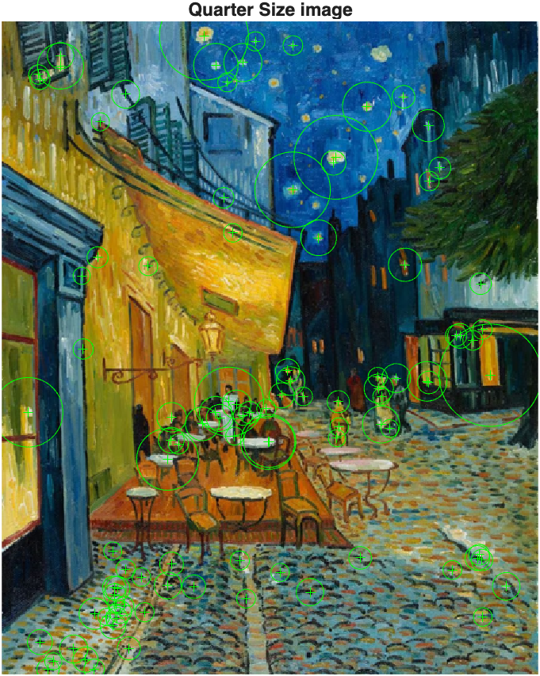 </p>

## Task 4: SIFT matching - scale and rotation invariance

The arrays *_points1_* and *_points2_* contains the interest points in the two images.  We now want to match the best *_Nbest_* points between the two sets. This is achieved as below:

```
[features1, valid_points1] = extractFeatures(f1, points1);
[features2, valid_points2] = extractFeatures(f2, points2);

 indexPairs = matchFeatures(features1, features2, 'Unique', true);

 matchedPoints1 = valid_points1(indexPairs(:,1),:);
 matchedPoints2 = valid_points2(indexPairs(:,2),:);
 figure(3);
 showMatchedFeatures(f1,f2,matchedPoints1,matchedPoints2);
```

Comment on the results.

> **Notes**:
> Even after rotating the smaller image by 20 degrees, SIFT still successfully
> matches features between the two images. This is because each SIFT descriptor
> is computed relative to the dominant orientation of its keypoint, making the
> descriptor invariant to image rotation.
> Using all detected points produces a very large number of matches between the
> two images, resulting in a dense web of connecting lines. While this confirms
> that SIFT is finding many corresponding features across the two scales, the
> sheer volume makes it difficult to visually assess match quality. Some of the
> matches will be incorrect where unrelated SIFT descriptors happen to be similar.
> <p align="center"> 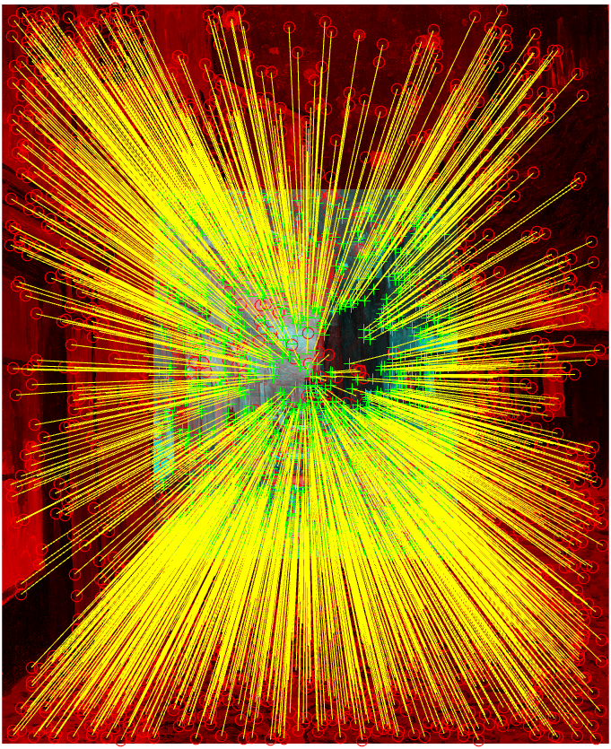 </p>

Now replace:
```
[features1, valid_points1] = extractFeatures(f1, points1);
```
with:
```
[features1, valid_points1] = extractFeatures(f1, bestFeatures1);
```
Comment on the results.

> **Notes**:
> Using only the 100 strongest features for the first image produces far fewer
> but more meaningful matches. The yellow lines now visibly connect corresponding
> features between the full size and quarter size images, you can see matches
> along the building edges, chairs, cobblestones and the sky. The reduction in
> clutter compared to the all-points match confirms that the strongest keypoints
> are the most distinctive and produce more reliable correspondences.
<p align="center"> 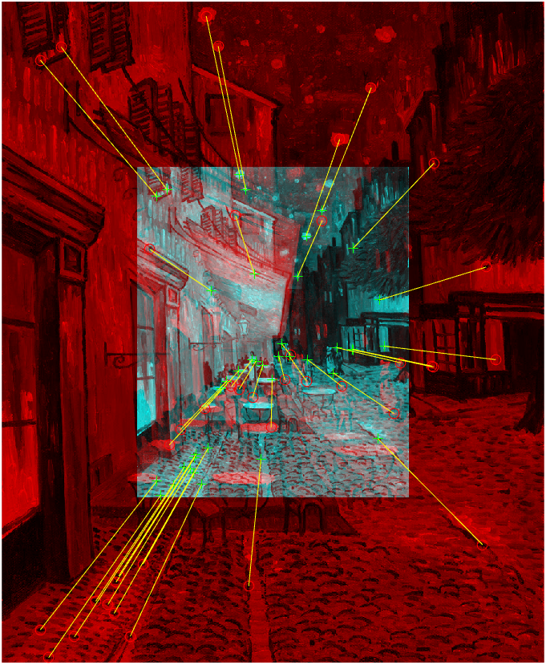 </p>

>Next, rotate the smaller image by 20 degrees using the Matlab function **_imrotate( )_** and show that indeed SIFT is rotation invariant.

> **Notes**:
> Even after rotating the smaller image by 20 degrees, SIFT still successfully
> matches features between the two images. The yellow lines connect corresponding
> points despite the combined difference in both scale and rotation. This
> demonstrates SIFT's rotation invariance, as each descriptor is computed relative
> to the dominant gradient orientation of its keypoint, so the descriptor remains
> the same regardless of how the image is rotated. SIFT is therefore invariant
> to both scale and rotation, making it far more robust than template matching
> methods like NCC which fail under these transformations.
> <p align="center"> 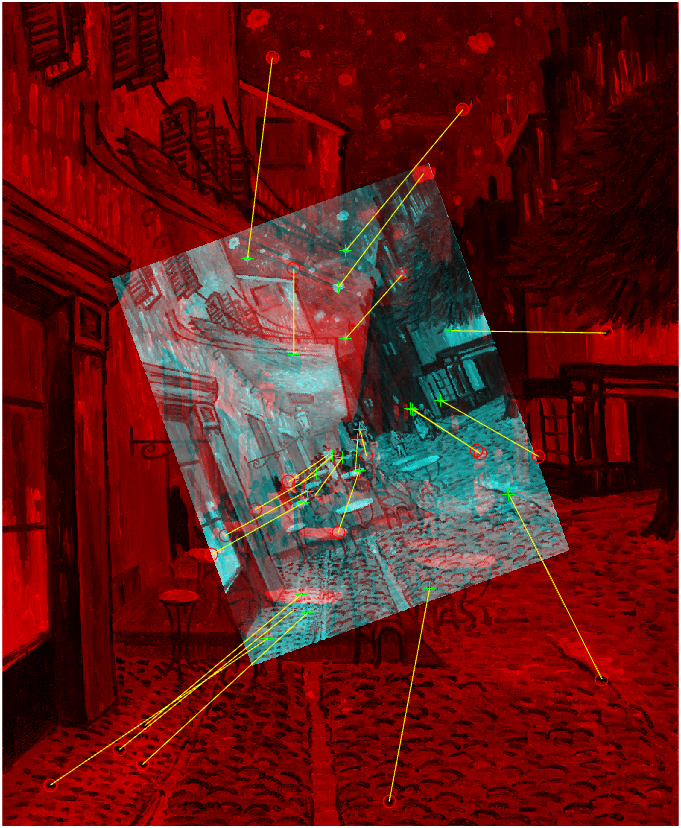 </p>

## Task 5: SIFT vs SURF

In addition to SIFT, there are other subsequently developed methods to detect features. These include:
* SURF
* KAZE
* BRISK
and others.  You will find these methods listed [here](https://uk.mathworks.com/help/vision/ug/local-feature-detection-and-extraction.html).

Let us now try to match two images from a video sequence of motorway traffic wtih cars moving bewteen frames.  The two still images are stored as *_'traffic_1.jpg'_* and *_'traffic_2.jpg'_*.  

>Use the same program in Task 4 to find the matching points between these two frames using SIFT.   Comment on the results.
>
>Now change the algorithm from SIFT to SURF, and see what the differences in the results.

> **Notes**:
> SIFT matching between the two highway frames struggles to find correct
> correspondences. While SIFT is invariant to scale and rotation, it is not
> invariant to significant perspective changes. As cars move further from the
> camera, they undergo a perspective transformation that changes their apparent
> shape and aspect ratio, not just their size or orientation. The matched points
> mostly land on static features like the road markings and lane lines at the
> bottom of the image rather than on the moving vehicles themselves.
> <p align="center"> 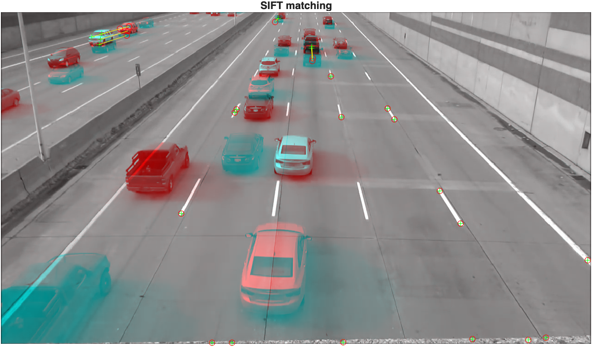 </p>
>
> SURF matching performs noticeably better than SIFT on the highway frames.
> It successfully matches features on vehicles across both frames, including
> cars further down the road that appear smaller and cars moving in the
> opposite direction on the other side. The yellow lines correctly connect
> corresponding features on the same vehicles between the two frames,
> suggesting SURF is more robust to the moderate perspective changes caused
> by vehicle movement than SIFT was in this scenario. This is likely because
> SURF uses box filter approximations rather than precise Gaussian derivatives,
> making its descriptors less sensitive to small deformations in shape.
> <p align="center"> 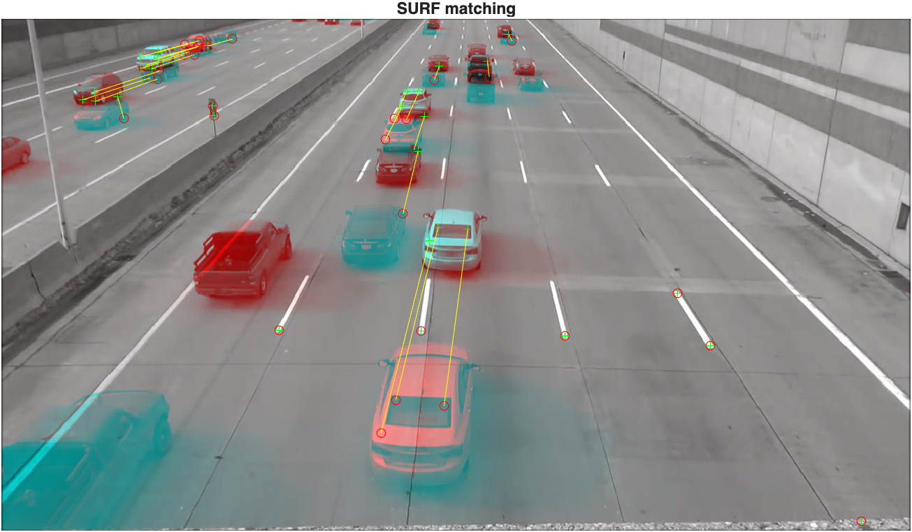 </p>

What you have just done is to apply SIFT and SURF feature detection to perform object tracking between successive frames in a video.


## Task 6: Image recognition using neural networks

This task requires you to install a number of packages on Matlab beyond what you already have on your system.  You will be using either your laptop camera or, if you use an iPhone, use the camera on the iPhone.  For this task, you will need to install the camera support package for your machine (either Mac or PC).  You will also need to install the specific neural network model (e.g. AlexNet) onto your machines.

Enter the following:
```
% Lab 6 Task 6 
% Object recognition using webcam and various neural network models

camera = webcam;                            % create camera object for webcam
net = google;                               % change this for other networks
inputSize = net.Layers(1).InputSize(1:2);   % find neural network input size
figure 
I = snapshot(camera);      
image(I);
f = imresize(I, inputSize);                 % resize image to match network
tic;                                        % mark start time
[label, score] = classify(net,f);           % classify f with neural network net
toc                                         % report elapsed time
title({char(label), num2str(max(score),2)}); % label object
```

> Use the webcam to try to recognize different objects.  Also try to find the accuracy and speed of recogniture for different networks.

> **Notes**:
> AlexNet was tested on several everyday objects using the iPhone camera via
> macOS Continuity Camera. The results were mixed depending on the object:
>
> The network correctly identified a pair of running shoes with high confidence
> (0.72) and a radiator with moderate confidence (0.51). However it failed on
> a set of keys, classifying them as a "safety pin" with low confidence (0.15),
> and classified a human face as a "spatula" with very low confidence (0.14).
> The failures suggest AlexNet struggles with objects that do not closely
> resemble its ImageNet training categories, or where the framing and context
> differ from typical training images.
> <p align="center"> 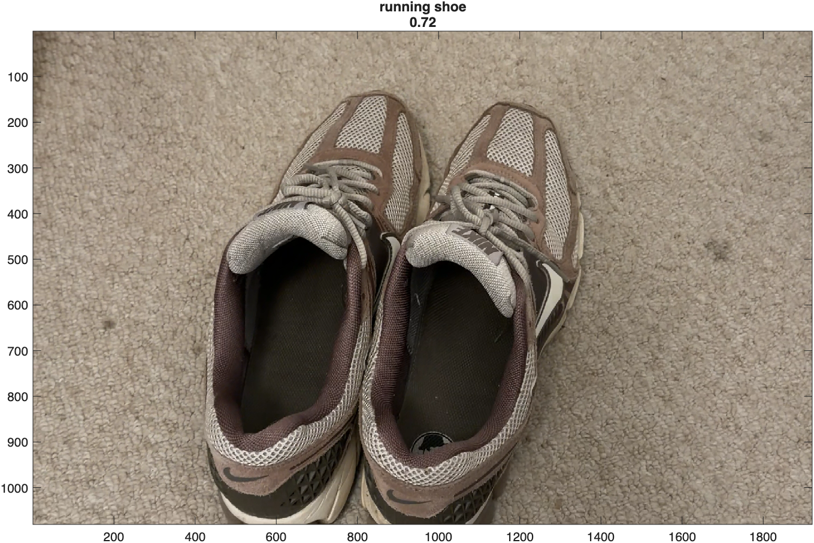 </p>
> <p align="center"> 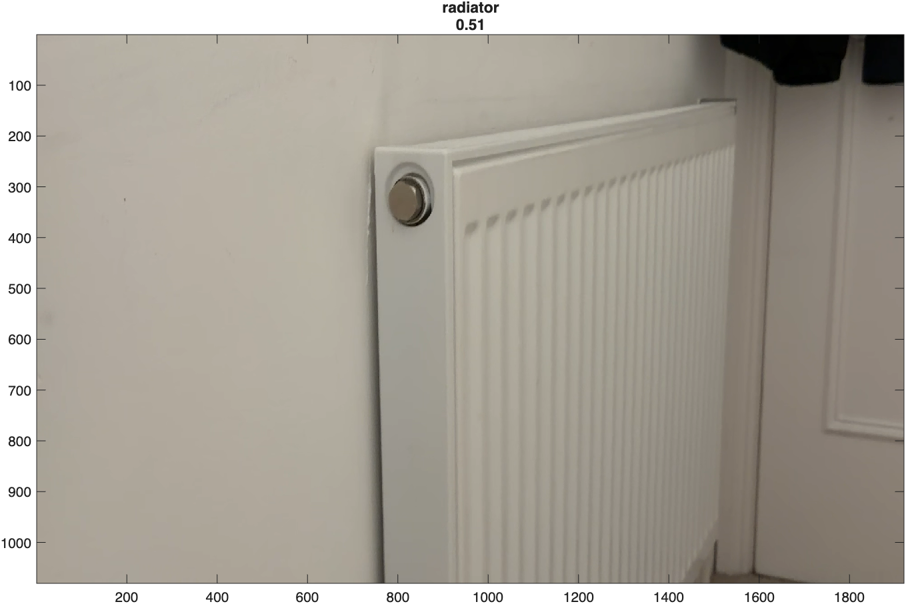 </p>
> <p align="center"> 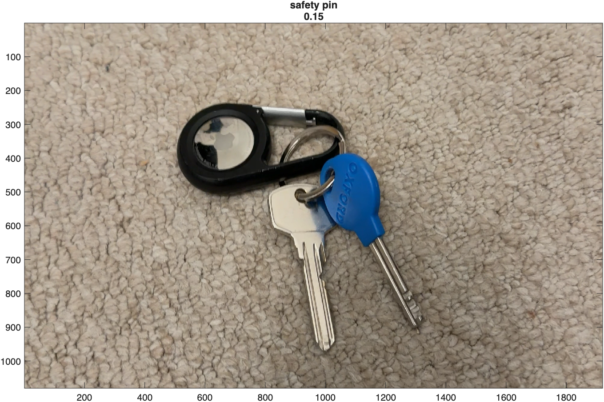 </p>
> <p align="center"> 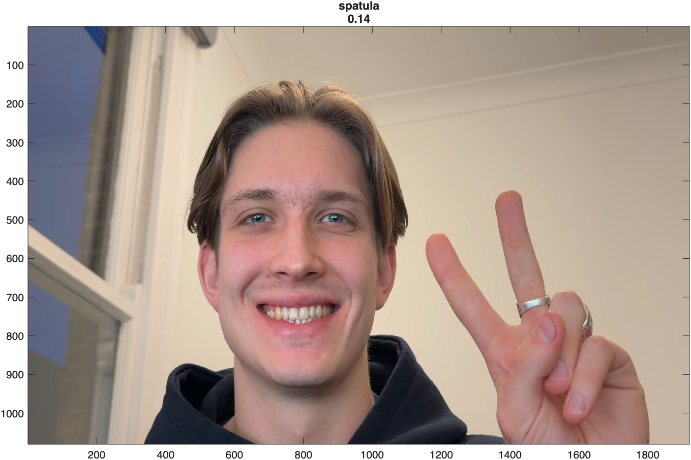 </p>
>
> Classification speed across many runs averaged around 0.23 seconds per frame,
> with times ranging from 0.10s to 0.49s. The first run was consistently slower at 1.38 seconds
> due to model loading overhead, with subsequent runs settling to around
> 0.1 to 0.25 seconds. This would allow roughly 4 to 10 classifications per
> second, which is fast enough for near real-time object recognition.

>
> Modify this code so that you capture and recognize object in a continous loop.

> **Notes**:
> The continuous loop version captures and classifies frames back to back,
> giving a live classification feed. The label and confidence score update
> in real time as different objects are shown to the camera. Pressing Ctrl+C
> in the MATLAB command window stops the loop.
> <p align="center">  </p>

You may also want to read and explore these online documents that accompany Matlab:

[Deep learning in Matlab](https://uk.mathworks.com/help/deeplearning/ug/deep-learning-in-matlab.html)

[Pretrained CNN](https://uk.mathworks.com/help/deeplearning/ug/pretrained-convolutional-neural-networks.html)
